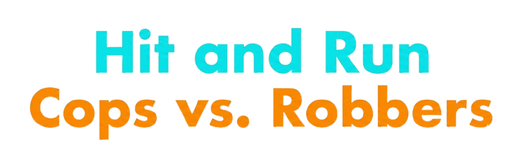
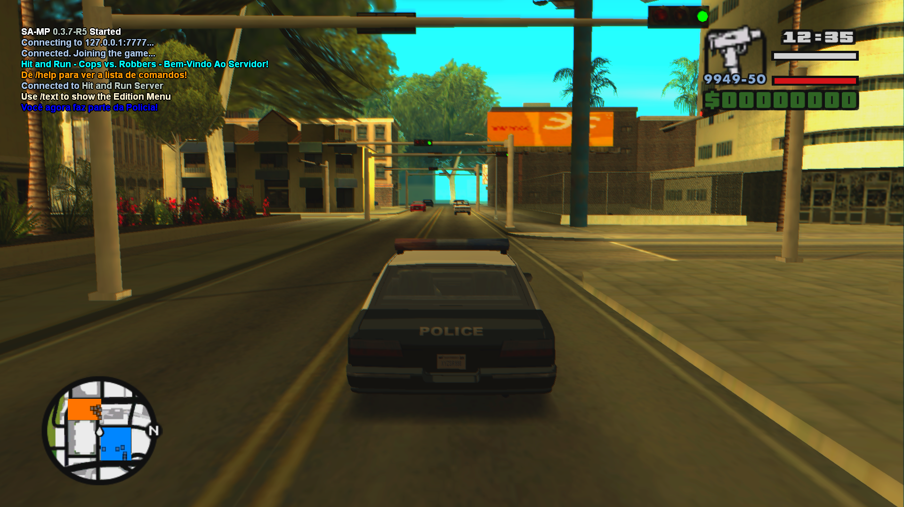
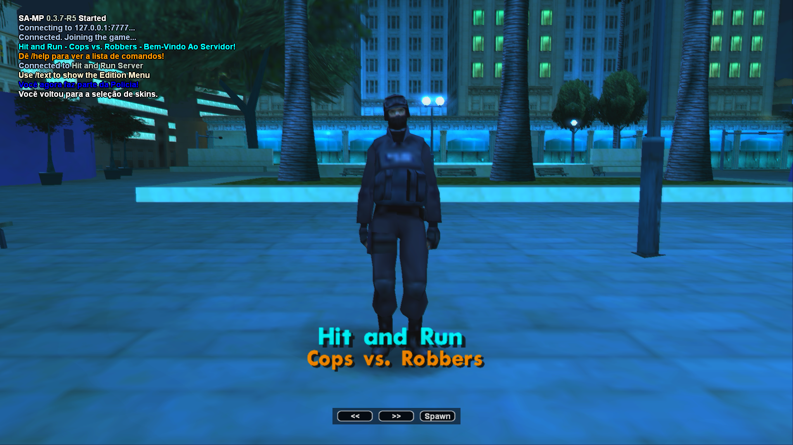
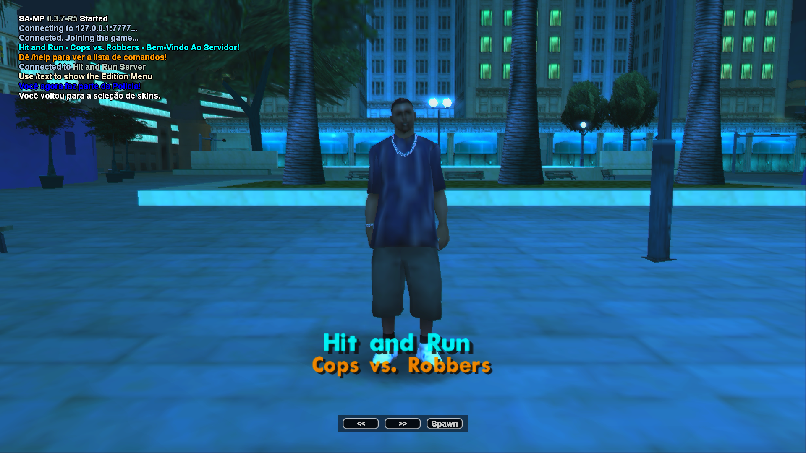
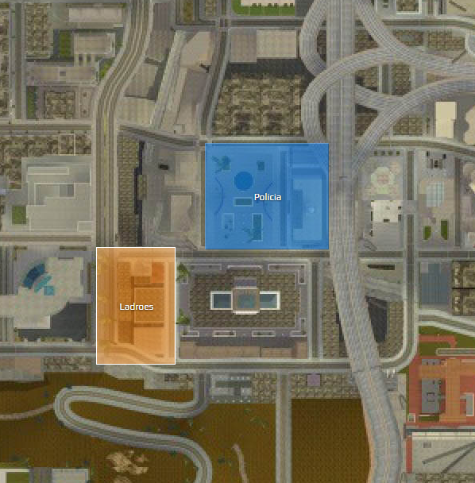
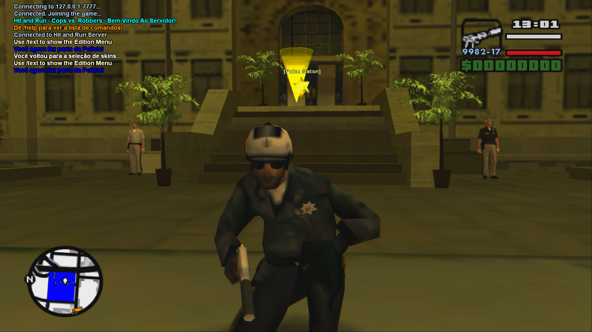
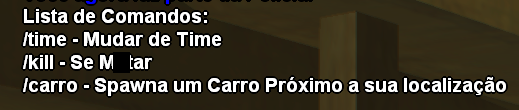

# Hit and Run - Cops vs. Robbers 🚔👮‍♂️

Gamemode de Team Deathmatch para SA-MP (San Andreas Multiplayer) onde os jogadores escolhem entre vestir a farda da Polícia ou entrar para o mundo do crime como Ladrão, se enfrentando em uma arena montada ao redor da Delegacia de Los Santos.



## O que é o SA-MP?

[SA-MP](https://www.sa-mp.com/) (San Andreas Multiplayer) é um mod gratuito para GTA: San Andreas que transforma o modo campanha offline do jogo em uma experiência multiplayer, permitindo que servidores de terceiros hospedem seus próprios modos de jogo (gamemodes) escritos na linguagem **Pawn**.

**Pawn** (antigamente conhecida como Small) é uma linguagem de script embutida, sem tipos (typeless) e com sintaxe muito próxima da linguagem C. É a linguagem padrão utilizada para criar gamemodes, sistemas e modificações de servidores SA-MP.

## O que é esse Gamemode?

**Hit and Run** é um Team Deathmatch construído em torno de duas facções fixas, Polícia e Ladrões, sem sistema de registro ou RPG por trás — o foco é o combate direto entre os dois times. A escolha de equipe acontece pela própria tela de seleção de skin do SA-MP: cada skin de policial coloca o jogador no time da lei, e cada skin de ladrão o coloca do lado do crime.



## Funcionalidades

### Seleção de equipe via skin
Em vez de um menu customizado, o projeto usa a seleção de skin nativa do SA-MP. Cada classe adicionada gera uma opção na tela de escolha, e a própria skin escolhida já define automaticamente o time do jogador.

| Time | Skins disponíveis |
|---|---|
| 🚓 Polícia | LSPD, SFPD, LVPD, Sheriff, Policial de Moto, SWAT, FBI, Militar do Exército |
| 🕵️ Ladrão | Gangster e variações de Traficante |




A tela de seleção de skin roda em um timeset noturno fixo, dando um clima mais dramático para a escolha do personagem. Assim que o jogador de fato dá spawn na partida, o timeset volta a acompanhar o horário real do servidor.

### Spawn e território
O spawn de ambos os times fica próximo à Delegacia de Los Santos, com as áreas de cada equipe marcadas no minimapa (zona azul para a Polícia, zona laranja para os Ladrões), facilitando a noção de território de cada lado assim que a partida começa.



### Armamento por equipe
Cada jogador recebe automaticamente um kit de armas de acordo com o time escolhido:

| Time | Armas |
|---|---|
| 🚓 Polícia | Cacetete, Pistola Silenciada, Micro-Uzi, M4 |
| 🕵️ Ladrão | Taco de Beisebol, Pistola Comum, TEC-9, AK-47 |

### Veículos
7 veículos ficam estacionados ao redor do spawn de cada equipe, com respawn automático de 5 minutos:

- **Polícia**: viaturas da LSPD, SFPD, LVPD, pick-up rural, blindado da SWAT e SUV do FBI, com sirene ativada.
- **Ladrão**: sedans, hatches e muscle cars civis (Premier, Blista Compact, Sentinel, Greenwood, Sabre, Admiral e Clover).

### NPCs de ambientação
Atores (NPCs) parados foram adicionados nas áreas de spawn como decoração, reforçando a atmosfera de cada território sem interferir na jogabilidade.



### Comandos

| Comando | Descrição |
|---|---|
| `/help` | Mostra a lista de comandos disponíveis |
| `/kill` | Mata o jogador imediatamente (útil para debug ou quando ele fica preso no mapa) |
| `/carro` | Spawna um veículo próximo ao jogador, sorteado a partir da frota do seu time |
| `/time` | Envia o jogador de volta para a tela de seleção de skins, permitindo trocar de time |



## Estrutura do projeto

O arquivo principal (`Hit_And_Run.pwn`) foi mantido enxuto, servindo apenas como ponto de integração. Toda a lógica foi separada em módulos `.inc` para facilitar manutenção:

```
gamemodes/
└── Hit_And_Run.pwn          # Arquivo principal, integra os módulos e trata os callbacks

pawno/include/
├── tdm_team.inc         # Times, spawns, skins, armas e veículos
├── tdm_commands.inc     # Comandos de chat (/help, /kill, /carro, /time)
└── tdm_colors.inc       # Constantes de cores usadas nas mensagens do chat

filterscripts/
└── Hit_And_Run_Titulo_Menu.pwn          # Logotipo do Gamemode
```

Esse desenvolvimento foi feito de forma iterativa: cada função nova era escrita primeiro em seu respectivo `.inc` e só depois integrada ao `.pwn` principal para teste.

## Dependências

- [ZCMD](https://github.com/Southclaws/ZCMD) — processador de comandos
- [sscanf2](https://github.com/Southclaws/sscanf) — conversão e validação de parâmetros de texto

## Como instalar e rodar

1. Baixe o [servidor SA-MP 0.3.7](https://www.sa-mp.com/download.php) para o seu sistema operacional.
2. Copie `Hit_And_Run.pwn` para a pasta `gamemodes/` do servidor.
3. Copie os arquivos `tdm_team.inc`, `tdm_commands.inc` e `tdm_colors.inc` para `pawno/include/`.
4. Garanta que os includes `ZCMD` e `sscanf2` também estejam em `pawno/include/`.
5. Compile `Hit_And_Run.pwn` usando o Pawno (`pawno.exe`) ou o compilador externo (`pawncc.exe`).
6. No `server.cfg`, defina o gamemode compilado (`gamemode0 Hit_And_Run 1`).
7. Inicie o servidor.

## O que já foi feito

- [x] Seleção de time via skin (Polícia / Ladrão)
- [x] Spawn próximo à Delegacia de Los Santos com territórios marcados no minimapa
- [x] Armas específicas por time
- [x] 7 veículos por time com respawn automático
- [x] Comandos `/help`, `/kill`, `/carro` e `/time`
- [x] Timeset noturno na tela de seleção de skin, revertendo ao horário real do servidor no spawn
- [x] NPCs de decoração nas áreas de spawn

## Roadmap / Limitações conhecidas

- [x] Limite de spawns de veículo por jogador (evitar abuso do `/carro`)
- [ ] Cooldown para o comando `/carro`
- [ ] Sistema de pontuação e placar de kills em tempo real
- [ ] Recompensas para o time vencedor ao final do round

## Referências e aprendizado

Projeto desenvolvido como estudo de Pawn para SA-MP, com apoio dos seguintes materiais:

- [SA-MP Wiki - PAWN for Beginners](https://sampwiki.blast.hk/wiki/PAWN_for_Beginners)
- [SA-MP Wiki - PAWN tutorial](https://sampwiki.blast.hk/wiki/PAWN_tutorial)
- [SA-MP Forum - PAWN For Beginners](https://sampforum.blast.hk/showthread.php?tid=451445)

## Licença

Projeto de domínio público, com fins educacionais e de estudo.

---

> Este gamemode foi desenvolvido por alguém em fase de aprendizado de Pawn, então partes do código ainda podem receber ajustes e melhorias conforme o projeto evolui.
